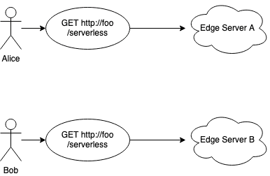
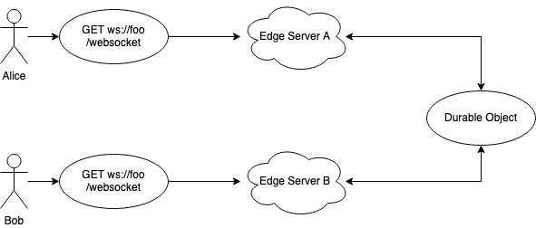

## Overview of Cloudflare Full Stack Offering
- Dev Edmonton Society JavaScript/Ruby Meetup
- December 2, 2021
- Alexander Wong

### About Me (2021)
- Finished my MSc. from University of Alberta
    - Supervised by Dr. Abram Hindle
- Started as a Senior Software Developer at [Intuit](https://intuit.com)
    - Quickbooks, Full Stack Development
- Neighbourhood blue jays have trained me to throw peanuts

### Disclaimer
- Not sponsored! Just curious

### Cloudflare Full Stack
- [Cloudflare Workers](https://workers.cloudflare.com/) (Sept 2017, GA March 2018)
  - No cold-start serverless functions on edge servers

- [Cloudflare Pages](https://pages.cloudflare.com/) (Dec 2020, GA April 2021)
  - Deploy and host static sites on edge servers

- [Cloudflare Workers - Durable Objects](https://developers.cloudflare.com/workers/runtime-apis/durable-objects) (Sept 2020, GA Nov 2021)
  - Low latency coordination and consistency for workers

### Alternatives
Many options exist for static site hosting and serverless functions (FaaS).
- [Github Pages](https://docs.github.com/en/pages/getting-started-with-github-pages/about-github-pages) (static sites)
- [Netlify](https://www.netlify.com) (static sites, FaaS)
- [Surge](https://surge.sh/) (static sites)
- [AWS Lambda@Edge](https://aws.amazon.com/lambda/edge/) (FaaS)
- [Azure Functions](https://docs.microsoft.com/en-us/azure/azure-functions/functions-overview) (FaaS)
- [Google Cloud Functions](https://cloud.google.com/functions/) (FaaS)

But what about durable objects? Why are they special?

Consider two users making a request a serverless function hosted on the edge network.

Requests to the serverless function endpoint are load balanced to a worker instance.

Durable Objects can be used to share state, like web socket sessions.

No need to deal with additional message broker. Each durable object has a globally unique identifier and exists at one location in the whole world at a time.

### Durable Objects
- Coordination: multiple edge requests can share memory (e.g. accessing the same class attributes)
- Storage: each object also has its own key value storage for long term persistence

Enables serverless real-time chat, collaborative editing, video conferencing, pub/sub message queues, game sessions, and much more!

## Demo and Source Code
[poll.udia.ca](https://poll.udia.ca/)

[github.com/awwong1/poll.udia.ca](https://github.com/awwong1/poll.udia.ca)

## See Also
- [Durable Objects - now Generally Available](https://blog.cloudflare.com/durable-objects-ga/)
- [Building a full stack application with Cloudflare Pages](https://blog.cloudflare.com/building-full-stack-with-pages/)
- [Cloudflare Workers Pricing](https://developers.cloudflare.com/workers/platform/pricing)
- [Cloudflare Pages](https://pages.cloudflare.com/)
- [Cloudflare Developers Discord Channel](https://discord.gg/cloudflaredev)

### Quirks
- Cloudflare Pages & Workers tooling is in flux, despite the products themselves being generally available
  - [Miniflare](https://miniflare.dev/) to serve locally instead of [`wrangler`](https://developers.cloudflare.com/workers/cli-wrangler)
    - No support for Cloudflare Pages
  - [`wrangler`](https://developers.cloudflare.com/workers/cli-wrangler) used to publish/deploy workers to Cloudflare
    - [When used to serve workers, no headers are set](https://github.com/cloudflare/wrangler/issues/2137)
  - [`wrangler@beta`](https://github.com/cloudflare/wrangler2) for serving pages with functions
    - Functions currently have a hard limit of 100,000 invocation requests per day, just use workers

### Cloudflare Workers has Module and Service Worker Syntax
- Only module syntax can be used with Cloudflare Workers Durable Objects
- Most of the existing tooling/support is for service worker syntax, however

See also: [developers.cloudflare.com/workers/cli-wrangler/configuration#build](https://developers.cloudflare.com/workers/cli-wrangler/configuration#build)
